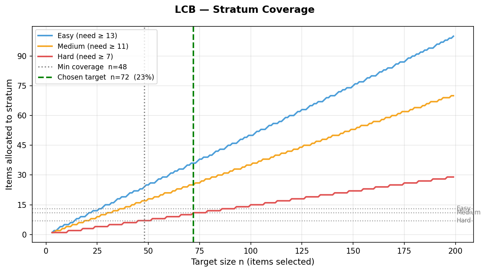
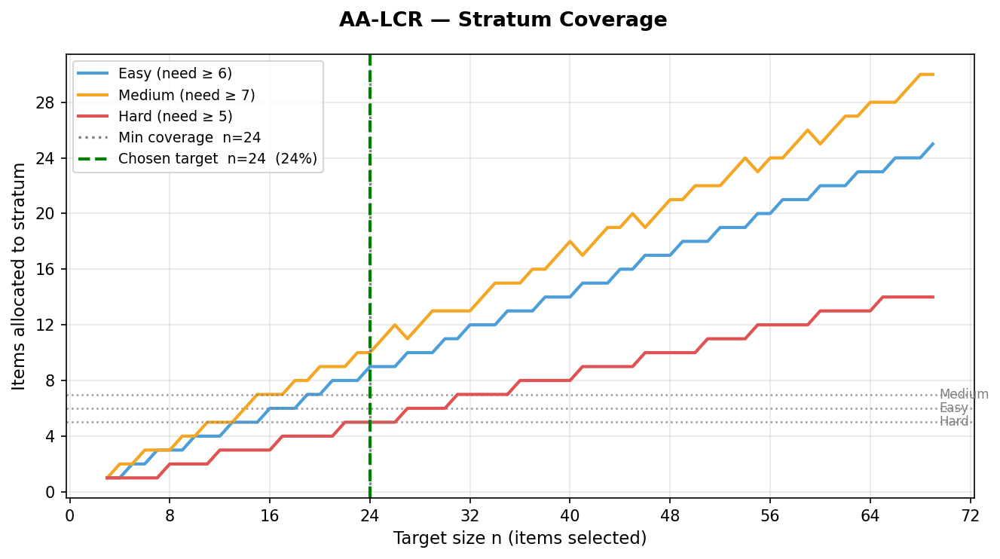
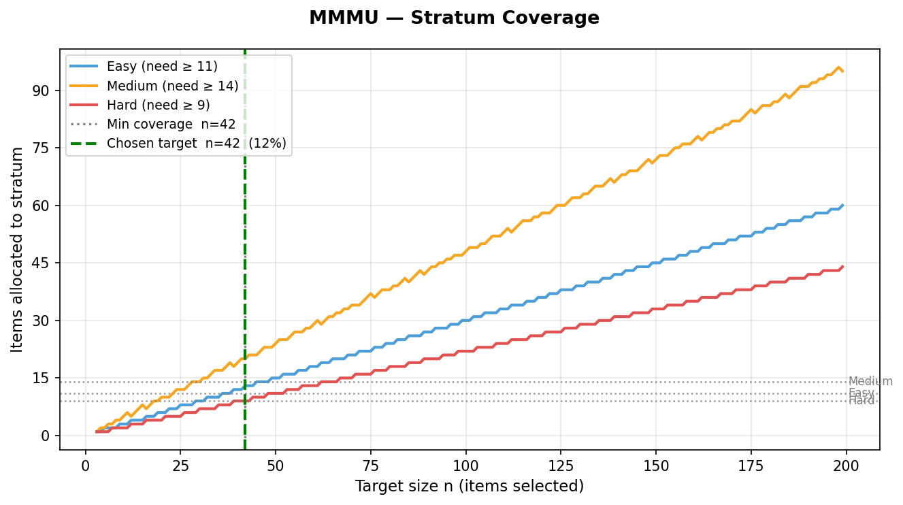
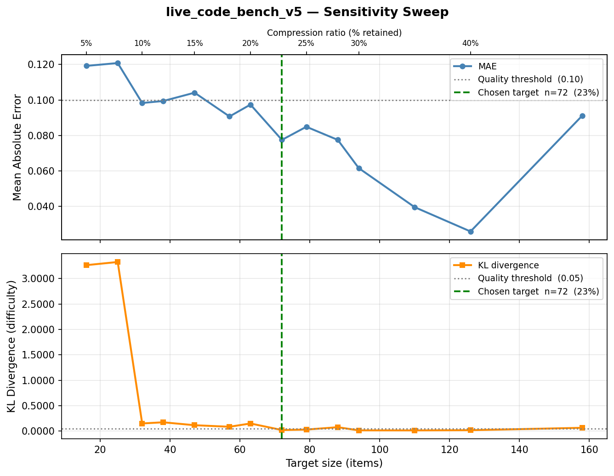
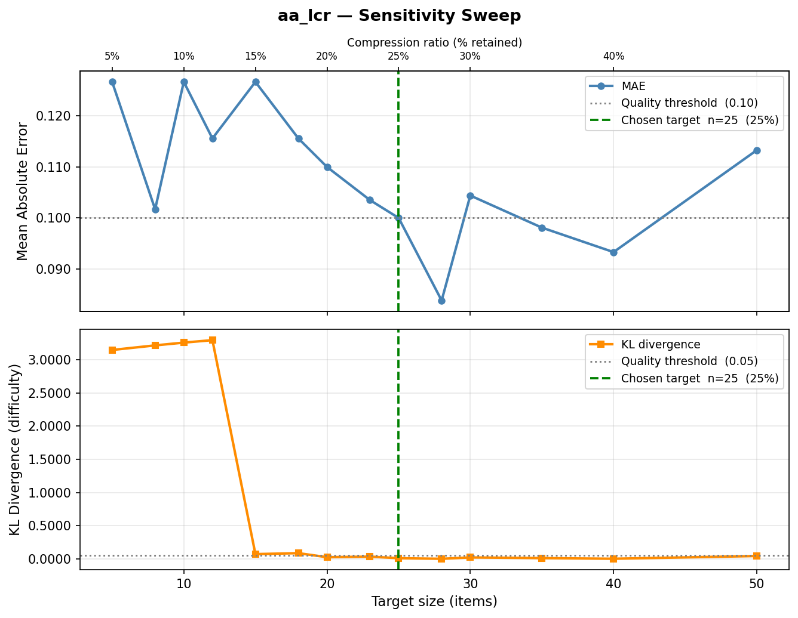
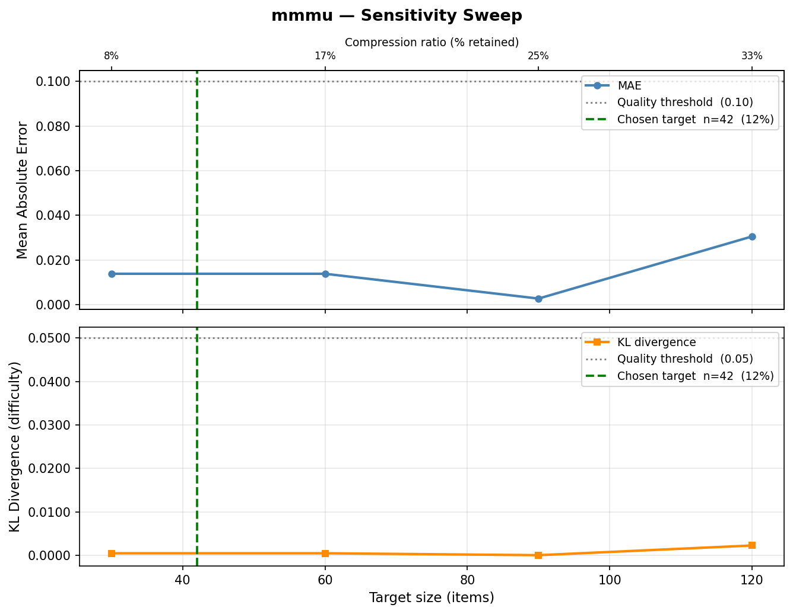

# Task 02 — Benchmark Pruning

Reduces three evaluation benchmarks to small, statistically representative subsets while preserving model rankings, Go/No-Go decisions, and difficulty distributions.

---

## Running the Pruner

### Part A — LCB and AA-LCR

Use the provided shell scripts from the `custom_pruner/` directory.

```bash
# Live Code Bench  (default n=72)
bash run_lcb.sh
bash run_lcb.sh 80        # override target size

# AA-LCR  (default n=24)
bash run_aalcr.sh
bash run_aalcr.sh 30      # override target size
```

Outputs are written to `output/lcb/` and `output/aalcr/` respectively.  Logs go to `logs/`.

To run directly:

```bash
python run_pruner.py <benchmark> <evals_dir> <output_dir> [target_size]
# benchmark: live_code_bench_v5 | aa_lcr
```

### Part B — MMMU

```bash
# MMMU  (default n=42)
bash part_b/run_mmmu.sh
bash part_b/run_mmmu.sh 60    # override target size
```

Output is written to `part_b/output/mmmu/`.

To run directly:

```bash
python part_b/run_pruner.py <evals_dir> <output_dir> [target_size]
```

### Output files

Each run produces three files in the output directory:

| File | Contents |
|------|----------|
| `selected_indices.json` | Indices of the selected items in the full benchmark |
| `pruning_report.json` | Stratum sizes, budgets, model abilities, compression ratio |
| `validation_report.json` | MAE, KL divergence, ranking, Go/No-Go, LOMO metrics |

---

## Method

### 1. Difficulty Stratification

Each benchmark item is assigned to one of three difficulty strata — **easy**, **medium**, or **hard** — based on the average pass rate across all evaluated models.  Items with high pass rates are easy and items rarely solved are hard.  This stratification ensures the pruned subset mirrors the difficulty profile of the full benchmark.

### 2. Budget Allocation

The target size `n` is split across strata proportionally to stratum size:

```
budget_s = round(n × |stratum_s| / |full_benchmark|)
```

Rounding is adjusted so budgets always sum exactly to `n` and each stratum receives at least one item.

### 3. Spectral Clustering Within Strata

Within each stratum, items are represented as feature vectors combining:
- **Text embeddings** of the problem statement — computed using [`all-MiniLM-L6-v2`](https://huggingface.co/sentence-transformers/all-MiniLM-L6-v2) via `sentence-transformers`.  Each problem text is encoded into a 384-dimensional dense vector, L2-normalised before use.
- **Item metadata** (difficulty tags, topic labels, etc.)

Spectral clustering groups items into `budget_s` clusters.  One representative item is selected per cluster using a criterion matched to the stratum's role:

- **Easy and Hard strata** — the item closest to the cluster centroid in embedding space is selected.  These strata anchor the difficulty extremes; what matters is that the selected item is a faithful, typical representative of that cluster's region of content space.

- **Medium stratum** — the item with the highest IRT informativeness is selected.  Medium-difficulty items are where models are most spread out in ability, so selecting the most discriminating item maximises the information the subset carries about relative model performance.

  **IRT informativeness** is computed using a 2PL-inspired formula (a full 2PL fit is not feasible with only 3 models, so the parameters are estimated analytically):

  | Symbol | Meaning | Estimate |
  |--------|---------|----------|
  | θ_m | Model ability | Mean score of model m across all items |
  | P_i | Item pass rate | Mean score on item i across all models |
  | a_i | Item discrimination | Point-biserial correlation between item scores and model abilities, clipped to [0, 1] |

  The information score for item i is then:

  ```
  I_i = a_i² × P_i × (1 − P_i)
  ```

  This is the Fisher information from the 2PL model evaluated at θ = b_i (difficulty = pass rate).  It peaks when P_i = 0.5 (item is neither too easy nor too hard for the current pool of models) and when a_i is high (item scores reliably separate stronger models from weaker ones).  Items where all models agree — all pass or all fail — contribute zero information regardless of discrimination.

---

## Target Size Selection

### Stratum Coverage Criterion

For spectral clustering to identify `k` meaningful groups within a stratum, the stratum needs to contain at least `k` items — and the minimum defensible `k` for a stratum of size `S` is `ceil(√S)` (the square-root rule for cluster stability).

Translating a per-stratum requirement into a global target size:

```
n_min = ceil( ceil(√S_hard) × N_total / S_hard )
```

The hard stratum is always the binding constraint because it is the smallest and therefore receives the fewest items under proportional allocation.

### Why These Three Targets

#### Live Code Bench (LCB) — n = 72 (22.9% of 315)

| Stratum | Size | Required clusters | Budget at n=72 |
|---------|------|-------------------|----------------|
| Easy    | 158  | 13                | 36             |
| Medium  | 111  | 11                | 25             |
| Hard    | 46   | 7                 | 11             |

The stratum coverage formula gives a floor of **n = 48**.  However, empirical validation at n=48 showed a ranking flip (Spearman ρ = 0.866) — the 48-item sample was too small to produce a reliable draw, and two models swapped positions relative to their true order.

The sensitivity sweep (see plots below) identified **n = 72** as the first target where both ranking is fully preserved (ρ = 1.0) and MAE falls below 10pp. Therefore there are two reasonons to choose n:

1. **Stratum coverage floor**: n ≥ 48 required for spectral clustering to function
2. **Quality threshold from sweep**: n ≥ 72 required for a representative, ranking-stable sample

#### AA-LCR — n = 24 (24.0% of 100)

| Stratum | Size | Required clusters | Budget at n=24 |
|---------|------|-------------------|----------------|
| Easy    | 36   | 6                 | 9              |
| Medium  | 43   | 7                 | 10             |
| Hard    | 21   | 5                 | 5              |

The stratum coverage formula gives **n = 24** directly (hard stratum: `ceil(5 × 100/21) = 24`).  Validation at n=24 confirmed ranking preserved (ρ = 1.0) and 100% Go/No-Go agreement.  No quality-threshold correction was needed.

#### MMMU — n = 42 (11.7% of 360)

| Stratum | Size | Required clusters | Budget at n=42 |
|---------|------|-------------------|----------------|
| Easy    | 108  | 11                | 13             |
| Medium  | 173  | 14                | 20             |
| Hard    | 79   | 9                 | 9              |

The stratum coverage formula gives **n = 42** exactly (hard stratum: `ceil(9 × 360/79) = 42`).  With only one model evaluated, MAE is 0.44pp at this target — the stratum coverage minimum is both necessary and sufficient.

---

## Stratum Coverage Plots

These plots show how the per-stratum budget grows with `n`.  The gray dotted horizontal lines are the per-stratum requirements (`ceil(√S)`); the colored solid lines are the actual budgets.  The gray dotted vertical line marks the stratum coverage minimum and the green dashed vertical line marks the chosen target.

**LCB** — coverage floor at n=48, chosen n=72 (quality constraint pushes it higher)



**AA-LCR** — coverage minimum equals chosen target (n=24)



**MMMU** — coverage minimum equals chosen target (n=42)



---

## Sensitivity Sweep Plots

Each benchmark was swept across 14 target sizes (5%–50% of full size), recording MAE and KL divergence at each point.  For LCB and AA-LCR this was a full 14-point sweep.  For MMMU, four data points were produced by running the pruner at n=30, 60, 90, 120.

The plots confirm that the chosen targets sit in the low-error region of both curves.

**LCB**



**AA-LCR**



**MMMU**



---

## Validation Results

All three subsets preserve the decisions that matter operationally: model ranking and Go/No-Go classification.  Absolute accuracy estimates carry 4–10pp noise at these compression ratios, which is expected given 3–4× reduction with only 3 models.

| Benchmark | Full | Pruned | Compression | MAE   | KL      | Ranking (ρ) | Go/No-Go |
|-----------|------|--------|-------------|-------|---------|-------------|----------|
| LCB       | 315  | 72     | 22.9%       | 0.078 | 0.021   | 1.0 ✓       | 100%     |
| AA-LCR    | 100  | 24     | 24.0%       | 0.102 | 0.034   | 1.0 ✓       | 100%     |
| MMMU      | 360  | 42     | 11.7%       | 0.004 | < 0.001 | N/A (1 model) | 100%  |

### Per-model accuracy

**LCB**

| Model         | Full  | Pruned | Error  |
|---------------|-------|--------|--------|
| gpt-oss-120b  | 0.765 | 0.847  | 0.082  |
| kimi-k2.5     | 0.629 | 0.556  | 0.073  |
| minimax-m2.5  | 0.619 | 0.542  | 0.077  |

**AA-LCR**

| Model         | Full  | Pruned | Error  |
|---------------|-------|--------|--------|
| gpt-oss-120b  | 0.480 | 0.375  | 0.105  |
| kimi-k2.5     | 0.660 | 0.792  | 0.132  |
| minimax-m2.5  | 0.640 | 0.708  | 0.068  |

**MMMU**

| Model         | Full  | Pruned | Error  |
|---------------|-------|--------|--------|
| glm-4.5v-fp8  | 0.686 | 0.691  | 0.004  |

### LOMO (Leave-One-Model-Out)

Measures how well the pruned subset estimates each model's score when that model is excluded from the pruner's fitting step — a robustness check against overfitting to a specific model's difficulty signal.

| Benchmark | LOMO mean error |
|-----------|-----------------|
| LCB       | 0.034           |
| AA-LCR    | 0.028           |
| MMMU      | N/A (1 model)   |
